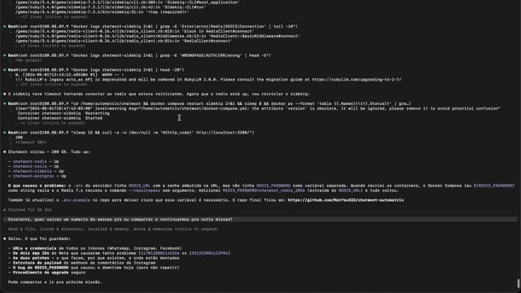
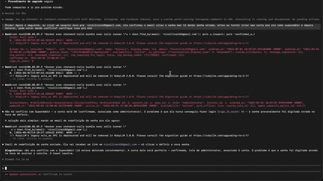
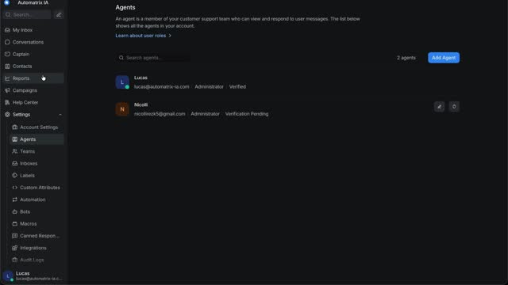
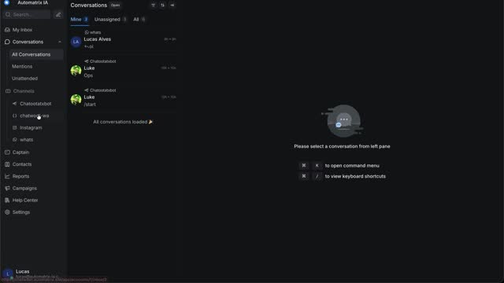
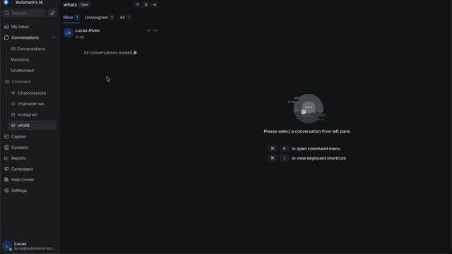

# 🏗️ Walkthrough — Arquitetura Chris Lamm para Saulo

> **Gravação:** 01 Mai 2026 · 16:11 · 13 min 38s  
> **Apresentado por:** Lucas F. N. Alves  
> **Tópicos:** Chatwoot · OpenClaw · N8N · BlueBubbles · iMessage · Salesforce · Outlook

---

## 📋 Índice

- [0:00](#️⃣-000) — Saulo, olha isso aqui, eu configurei esse chatroot aqui só n...
- [0:10](#️⃣-010) — Aí eu modifiquei esse chatroot pra ele conectar no Instagram...
- [0:20](#️⃣-020) — comentário, né? Só DM.
- [0:30](#️⃣-030) — Mano, eu fiz um negócio muito da hora, eu tô manjando muito ...
- [0:40](#️⃣-040) — o WhatsApp sem ser oficial, o Instagram e...
- [0:50](#️⃣-050) — o whatsapp, o whatsapp oficial que eu criei ontem esse aqui ...
- [1:00](#️⃣-100) — daqui a pouco eu vou conectar mais coisa aqui aí mano, no ca...
- [1:10](#️⃣-110) — negócio do cara é o seguinte, tá vendo?
- [1:20](#️⃣-120) — tem um iMessages aqui
- [1:30](#️⃣-130) — Tá funcionando belezinha.
- [1:40](#️⃣-140) — Tipo, quando aperta o botão lá de enviar, né?
- [1:50](#️⃣-150) — Aí, esse aqui, ó, fica criando autodraft.
- [2:00](#️⃣-200) — Tá vendo? Quando não tem resposta, não tem resposta.
- [2:10](#️⃣-210) — Mas,
- [2:30](#️⃣-230) — aqui
- [2:40](#️⃣-240) — mini dele esse aqui já é outro chatroot o chatroot tá na vps...
- [2:50](#️⃣-250) — é o copilot aqui ó aí dá pra clicar aqui também às vezes ess...
- [3:00](#️⃣-300) — não funciona
- [3:10](#️⃣-310) — Não funcionou.
- [3:20](#️⃣-320) — Mas tem gente quando tem muita conversa ele funciona.
- [3:30](#️⃣-330) — Tem que deixar ele bem da hora, mas esse aqui você não preci...
- [3:40](#️⃣-340) — O e-mail dele é Outlook, tá conectado numa gambiarra muito l...
- [3:50](#️⃣-350) — Aí agora o admin autorizou, o Gustavo vai conectar o Outlook...
- [4:00](#️⃣-400) — Se precisar não, vai precisar, né? Que não dá pra ficar usan...
- [4:10](#️⃣-410) — isso aqui eu fiz tudo no prompt, opencloud, tipo o meu openc...
- [4:20](#️⃣-420) — autodraft ó,
- [4:30](#️⃣-430) — Mas tem que dar uma averiguada nele, mas tipo assim, tem que...
- [4:40](#️⃣-440) — O que eu tô falando pra você é pra deixar seguro.
- [4:50](#️⃣-450) — Aqui
- [5:00](#️⃣-500) — Outbound, Dispatch, Autodraft, Open Cloud, Copilot, Proxy. É...
- [5:10](#️⃣-510) — aceita... não é compatível, aí ele faz esse proxy aqui.
- [5:20](#️⃣-520) — Ah, e isso aqui tá conectado no Mac Mini dele por ter o scal...
- [5:30](#️⃣-530) — Eu acho que às vezes ele tá gerando as respostas e não tá co...
- [5:40](#️⃣-540) — Esse autodraft é o que ele fica gerando no automático.
- [6:00](#️⃣-600) — será que é isso?
- [6:10](#️⃣-610) — Get AI draft.
- [6:20](#️⃣-620) — aqui com certeza tem que otimizar. Olha, a payzone aqui expo...
- [6:30](#️⃣-630) — Que
- [6:40](#️⃣-640) — Post
- [6:50](#️⃣-650) — as a draft, name Chris Lam, available avatar, offline, creat...
- [7:00](#️⃣-700) — Esses autodrafts aqui... Caraca, mano... Mano, ele recebe me...
- [7:10](#️⃣-710) — Ah, esse aqui, ó. Esse autodraft é esse aqui.
- [7:20](#️⃣-720) — Não sei por que ele não tá aparecendo aqui.
- [7:30](#️⃣-730) — Mas beleza.
- [7:40](#️⃣-740) — Por enquanto.
- [7:50](#️⃣-750) — E tem uns de vídeo aqui de extração de concorrente e tal.
- [8:00](#️⃣-800) — aqui agora dá pra configurar, ó. Antes não dava, agora dá.
- [8:10](#️⃣-810) — Que a mulher autorizou lá.
- [8:20](#️⃣-820) — Olha lá, autorizou, conectou.
- [8:30](#️⃣-830) — Aí, show.
- [8:40](#️⃣-840) — Esse
- [8:50](#️⃣-850) — O pessoal fez esse Node aqui.
- [9:00](#️⃣-900) — Ah, tem um monte de workflow aqui, nada a ver.
- [9:10](#️⃣-910) — Um monte, um monte, um monte.
- [9:20](#️⃣-920) — demonstração mas eu acho que é basicamente mas depois a gent...
- [9:30](#️⃣-930) — São esses aqui os principais.
- [9:40](#️⃣-940) — Também.
- [9:50](#️⃣-950) — É, é aquilo ali, mano. Aquilo ali e o chatroot dele na VPS, ...
- [10:00](#️⃣-1000) — Ah,
- [10:10](#️⃣-1010) — Tem uma instância na VPS dele com o Salesforce CLI.
- [10:20](#️⃣-1020) — e tá usando o Salesforce CLI por lá.
- [10:30](#️⃣-1030) — Mas aí depois a gente largou pra lá.
- [10:40](#️⃣-1040) — No Salesforce CLI.
- [11:00](#️⃣-1100) — pra estar aparecendo aqui, teve umas execuções aqui que deu ...
- [11:10](#️⃣-1110) — esse trem aqui não tá usando o Salesforce CLI, eu acho, né?
- [11:20](#️⃣-1120) — é isso o negócio desse cara é isso basicamente aí aqui eu vo...
- [11:30](#️⃣-1130) — com um agente desse aqui provavelmente esse aqui ó e aí esse...
- [11:40](#️⃣-1140) — para outros agentes para poder achar ele ajudar ele a conect...
- [11:50](#️⃣-1150) — usando um agente aqui ó
- [12:00](#️⃣-1200) — bagunça que nós estamos fazendo aí,
- [12:10](#️⃣-1210) — o opencloud ele é tá conectado com
- [12:20](#️⃣-1220) — independente de VPS, independente de tudo, entendeu? De chat...
- [12:30](#️⃣-1230) — E aí... O Bluebubbles, ele só faz o papel de rotear as mesma...
- [12:40](#️⃣-1240) — só faz o papel de rotear lá para a VPS do iMessages, entende...
- [12:50](#️⃣-1250) — Tipo assim, as respostas estão bem boas e tal, a missão noss...
- [13:00](#️⃣-1300) — documentar, entender o que a gente tá fazendo e principalmen...
- [13:10](#️⃣-1310) — Mas essa gambiarra aí com o Teio Scale e esse monte de coisa...
- [13:20](#️⃣-1320) — É isso aí que vai ser o challenge.
- [13:30](#️⃣-1330) — Falou, mano, usa as melhores ferramentas que tiver.

---

## 📺 Transcrição com Frames

### ⏱️ 0:00

**`0:00`** Saulo, olha isso aqui, eu configurei esse chatroot aqui só no prompt.

**`0:05`** Aqui eu tô no Mac e esse chatroot tá instalado ali no meu Xeon, o outro computador que fica ali.

---

### ⏱️ 0:10

**`0:11`** Aí eu modifiquei esse chatroot pra ele conectar no Instagram e pra ele rotear comentário, porque o chatroot não aceita

---

### ⏱️ 0:20

**`0:20`** comentário, né? Só DM.

**`0:23`** E aí eu configurei todos os canais de comunicação dele só no prompt ali.

---

### ⏱️ 0:30

**`0:29`** Mano, eu fiz um negócio muito da hora, eu tô manjando muito de chatbot assim, começando a fazer um negócio

**`0:34`** muito legal aqui nele. Aí tem tudo aqui ó, o Telegram, com os bots,

---

### ⏱️ 0:40

**`0:39`** o WhatsApp sem ser oficial, o Instagram e...

---

### ⏱️ 0:50

**`0:47`** o whatsapp, o whatsapp oficial que eu criei ontem esse aqui tudo eu criei de ontem pra hoje ó, de

**`0:52`** madrugada esse aqui com o whatsapp oficial esse aqui sem o whatsapp oficial esse aqui instagram e esse aqui telegram

---

### ⏱️ 1:00

**`0:58`** daqui a pouco eu vou conectar mais coisa aqui aí mano, no caso do cara o

---

### ⏱️ 1:10

**`1:13`** negócio do cara é o seguinte, tá vendo?

---

### ⏱️ 1:20

**`1:15`** tem um iMessages aqui

**`1:18`** Aí,

**`1:19`** acho que eu te mostrei o workflow que roteia as mensagens do iMessages.

**`1:25`** É esse aqui.

---

### ⏱️ 1:30

**`1:27`** Tá funcionando belezinha.

**`1:29`** Aí, esse aqui é o que acontece quando ele envia mensagem.

---

### ⏱️ 1:40

**`1:35`** Tipo, quando aperta o botão lá de enviar, né?

**`1:39`** É aquele ali. Acredito eu.

**`1:44`** E quando recebe também.

**`1:45`** Quem fez esse aqui foi... Esse aqui foi eu, mas aquele lá, bonitão, foi o Gustavo.

---

### ⏱️ 1:50

**`1:51`** Aí, esse aqui, ó, fica criando autodraft.

**`1:54`** Então, vários... Vários contatos dele... Ele fica criando autodraft.

---

### ⏱️ 2:00

**`2:01`** Tá vendo? Quando não tem resposta, não tem resposta.

**`2:03`** Será que ele parou agora?

---

### ⏱️ 2:10

**`2:06`** Mas,

**`2:10`** ó, por exemplo...

**`2:12`** se eu vier aqui, vamos pegar esse cara aqui por exemplo se eu vier aqui eu posso escrever e selecionar

---

### ⏱️ 2:30

**`2:26`** aqui

**`2:31`** chamar o copilot do chatroot só que o copilot do chatroot tá conectado lá no opencloud que tá no mac

---

### ⏱️ 2:40

**`2:39`** mini dele esse aqui já é outro chatroot o chatroot tá na vps dele aquela lá que você viu junto

**`2:44`** com o n8n e aí tem várias conexões com o opencloud uma delas é esse draft e a outra delas

---

### ⏱️ 2:50

**`2:52`** é o copilot aqui ó aí dá pra clicar aqui também às vezes esse sumarize funciona às vezes esse sumarize

---

### ⏱️ 3:00

**`3:00`** não funciona

**`3:02`** Será que vai funcionar nesse cara aqui?

---

### ⏱️ 3:10

**`3:12`** Não funcionou.

---

### ⏱️ 3:20

**`3:15`** Mas tem gente quando tem muita conversa ele funciona.

**`3:20`** Mas esse copilot, esse copilot aqui tem que dar uma otimizada nele, mas ele tá bem bonzinho.

---

### ⏱️ 3:30

**`3:26`** Tem que deixar ele bem da hora, mas esse aqui você não precisa se preocupar.

**`3:34`** E aqui o e-mail dele é Outlook, ó.

---

### ⏱️ 3:40

**`3:36`** O e-mail dele é Outlook, tá conectado numa gambiarra muito louca, com Zoom, Zoom não, Zapier e N8n,

**`3:43`** porque o Outlook dele não tinha autorização de pegar as credenciais lá, o admin tinha que autorizar.

---

### ⏱️ 3:50

**`3:51`** Aí agora o admin autorizou, o Gustavo vai conectar o Outlook direito, se precisar.

---

### ⏱️ 4:00

**`3:55`** Se precisar não, vai precisar, né? Que não dá pra ficar usando Zapier.

**`3:59`** O que mais que temos?

---

### ⏱️ 4:10

**`4:07`** isso aqui eu fiz tudo no prompt, opencloud, tipo o meu opencloud, o meu computador faz a ssh no mac

**`4:14`** mini dele, faz a ssh na vps e vai configurando tudo aí esse

---

### ⏱️ 4:20

**`4:22`** autodraft ó,

**`4:24`** que ele roda pra caramba, deixa eu ver ele aqui, se ele tá falhando muito até que não

---

### ⏱️ 4:30

**`4:32`** Mas tem que dar uma averiguada nele, mas tipo assim, tem que deixar isso aí tudo seguro, né?

---

### ⏱️ 4:40

**`4:36`** O que eu tô falando pra você é pra deixar seguro.

**`4:39`** Essas partes de desenvolver, eu acho que eu e o Gustavo fazemos, mas se você quiser fazer também, ótimo.

---

### ⏱️ 4:50

**`4:46`** Aqui

**`4:51`** é o Chatbot Bridge que eu te mostrei.

---

### ⏱️ 5:00

**`4:56`** Outbound, Dispatch, Autodraft, Open Cloud, Copilot, Proxy. É esse aqui, ó.

**`5:00`** Esse aqui é o que faz um proxy pro Copilot, porque tipo, o Endpoint lá, a configuraçãozinha do Copilot não

---

### ⏱️ 5:10

**`5:07`** aceita... não é compatível, aí ele faz esse proxy aqui.

**`5:11`** Eu nem vi isso aqui, a IA fez aqui, eu nem li o que que fez.

---

### ⏱️ 5:20

**`5:15`** Ah, e isso aqui tá conectado no Mac Mini dele por ter o scale.

**`5:24`** Então o copilotzinho, ele passa nesse proxy.

---

### ⏱️ 5:30

**`5:31`** Eu acho que às vezes ele tá gerando as respostas e não tá conseguindo mandar lá no chat útil.

---

### ⏱️ 5:40

**`5:43`** Esse autodraft é o que ele fica gerando no automático.

---

### ⏱️ 6:00

**`5:55`** será que é isso?

**`5:56`** Ah, é o filtro de inbound.

**`5:59`** Olha lá, esse draft aqui ele gerou.

---

### ⏱️ 6:10

**`6:06`** Get AI draft.

**`6:09`** Post draft as private note.

**`6:13`** Esse

---

### ⏱️ 6:20

**`6:17`** aqui com certeza tem que otimizar. Olha, a payzone aqui exposta.

**`6:22`** Esse aqui é ok. Ah, esse aqui é o API do chat útil.

---

### ⏱️ 6:30

**`6:27`** Que

**`6:31`** louco isso aqui, velho. Olha o contexto que ele recebe, ou a gente recebe.

---

### ⏱️ 6:40

**`6:41`** Post

---

### ⏱️ 6:50

**`6:46`** as a draft, name Chris Lam, available avatar, offline, created.

**`6:52`** Are you meeting Thursday?

**`6:54`** Será que acha esse autodraft?

---

### ⏱️ 7:00

**`6:58`** Esses autodrafts aqui... Caraca, mano... Mano, ele recebe mensagem com força.

---

### ⏱️ 7:10

**`7:10`** Ah, esse aqui, ó. Esse autodraft é esse aqui.

**`7:13`** Tá vendo? Mas era pra ele aparecer aqui, velho.

---

### ⏱️ 7:20

**`7:16`** Não sei por que ele não tá aparecendo aqui.

**`7:19`** Porque a ideia era o autodraft aparecer aqui automaticamente.

**`7:24`** E ele melhora aqui e manda.

---

### ⏱️ 7:30

**`7:30`** Mas beleza.

**`7:33`** Eu acho que é só isso.

---

### ⏱️ 7:40

**`7:36`** Por enquanto.

**`7:38`** Só esses workflow aí que tem por enquanto.

**`7:40`** Tô configurando um aqui de fazer as transcrições no automático.

---

### ⏱️ 7:50

**`7:46`** E tem uns de vídeo aqui de extração de concorrente e tal.

**`7:51`** Ah, tem esses aqui de e-mail também, tá vendo?

**`7:54`** Isso

---

### ⏱️ 8:00

**`8:01`** aqui agora dá pra configurar, ó. Antes não dava, agora dá.

**`8:03`** Deixa eu ver aqui. Às vezes até já autenticou aqui, ó.

---

### ⏱️ 8:10

**`8:06`** Que a mulher autorizou lá.

---

### ⏱️ 8:20

**`8:21`** Olha lá, autorizou, conectou.

**`8:24`** Que beleza.

**`8:25`** Esse aqui autorizou ontem, o pessoal liberou lá do admin dele ontem.

---

### ⏱️ 8:30

**`8:31`** Aí, show.

---

### ⏱️ 8:40

**`8:37`** Esse

**`8:43`** aqui foi o Gustavo que fez.

---

### ⏱️ 8:50

**`8:46`** O pessoal fez esse Node aqui.

**`8:50`** Vou desligar ele por enquanto.

---

### ⏱️ 9:00

**`8:56`** Ah, tem um monte de workflow aqui, nada a ver.

**`9:01`** Nós vamos dar uma limpada aqui gigantesca.

**`9:04`** Um monte aqui de workflow, nada a ver.

---

### ⏱️ 9:10

**`9:06`** Um monte, um monte, um monte.

**`9:09`** Será que isso aqui tá funcionando?

**`9:11`** Não, isso aqui é só de...

---

### ⏱️ 9:20

**`9:16`** demonstração mas eu acho que é basicamente mas depois a gente vai ver com Gustavo também vai te mostrar mas

**`9:22`** tem quase certeza que são exatamente só esses aí.

---

### ⏱️ 9:30

**`9:32`** São esses aqui os principais.

---

### ⏱️ 9:40

**`9:35`** Também.

**`9:38`** Agora, ah tá, esse aqui são outras versões, esse aqui pode arquivar talvez, porque o OpenCloud ele vai criar um

**`9:45`** workflow, aí quando ele vai melhorar ele vai fazendo outras versões até ficar bom.

---

### ⏱️ 9:50

**`9:53`** É, é aquilo ali, mano. Aquilo ali e o chatroot dele na VPS, que é o mais importante.

---

### ⏱️ 10:00

**`9:59`** Ah,

**`10:00`** eu não sei se esse negócio aqui tá usando o Salesforce CLI que tá instalado na VPS dele.

---

### ⏱️ 10:10

**`10:06`** Tem uma instância na VPS dele com o Salesforce CLI.

**`10:10`** Mas o que eu acho que tá rolando aqui é...

**`10:14`** Aqui tá mandando pro agente do OpenCloud lá no Mac Mini dele.

---

### ⏱️ 10:20

**`10:19`** e tá usando o Salesforce CLI por lá.

**`10:22`** A gente chegou a configurar aqui uma vez, quer ver, mano?

---

### ⏱️ 10:30

**`10:26`** Mas aí depois a gente largou pra lá.

**`10:29`** Acho que é esse aqui.

**`10:31`** Esse aqui, ó.

**`10:33`** Que aí ele dá uns get aqui, ó.

---

### ⏱️ 10:40

**`10:37`** No Salesforce CLI.

**`10:40`** Esse aqui pode servir também pra alguma coisa.

**`10:43`** Ó, tem até a API aqui já configurada.

**`10:45`** ele deu uns gates aqui, ele pega o histórico do contato pega os empréstimos e salva no Super Base era

---

### ⏱️ 11:00

**`10:55`** pra estar aparecendo aqui, teve umas execuções aqui que deu certo não sei se foi nesse ou se foi em

**`10:59`** outro mas só pra você saber que tem esses nodes aqui e tem um Salesforce CLI instalado na VPS, mas

---

### ⏱️ 11:10

**`11:09`** esse trem aqui não tá usando o Salesforce CLI, eu acho, né?

**`11:12`** esse aqui é o API normal do Salesforce

---

### ⏱️ 11:20

**`11:19`** é isso o negócio desse cara é isso basicamente aí aqui eu vou te conectar na vps você vai falar

---

### ⏱️ 11:30

**`11:33`** com um agente desse aqui provavelmente esse aqui ó e aí esse agente aqui talvez vai ter que pedir ele

---

### ⏱️ 11:40

**`11:39`** para outros agentes para poder achar ele ajudar ele a conectar no vps a fazer as coisas mas eu tô

---

### ⏱️ 11:50

**`11:47`** usando um agente aqui ó

**`11:50`** acho que é esse,

**`11:52`** é eu acho que é esse aqui que ele consegue fazer ssh, conectar na vps, faz tudo essa é a

---

### ⏱️ 12:00

**`11:58`** bagunça que nós estamos fazendo aí,

**`12:02`** o blue bubbles aqui ó, aí tipo assim,

---

### ⏱️ 12:10

**`12:06`** o opencloud ele é tá conectado com

**`12:14`** Tipo, o OpenCloud responde as mensagens, ele tá conectado com o iMessages do cara,

---

### ⏱️ 12:20

**`12:19`** independente de VPS, independente de tudo, entendeu? De chatboot, porque o OpenCloud dele tá conectado direto pelo iMessages.

---

### ⏱️ 12:30

**`12:28`** E aí... O Bluebubbles, ele só faz o papel de rotear as mesmas mensagens que chegam para o OpenCloud, ele

---

### ⏱️ 12:40

**`12:35`** só faz o papel de rotear lá para a VPS do iMessages, entendeu?

**`12:40`** O Bluebubbles é como se fosse uma Evolution API.

---

### ⏱️ 12:50

**`12:47`** Tipo assim, as respostas estão bem boas e tal, a missão nossa é o que?

**`12:52`** É otimizar, fazer ficar melhor ainda, estável,

---

### ⏱️ 13:00

**`12:56`** documentar, entender o que a gente tá fazendo e principalmente deixar isso aí seguro.

**`13:01`** O que eu quero ver o bicho pegar é deixar isso aí seguro.

**`13:03`** Assim, né? Eu não tenho ideia de nada.

---

### ⏱️ 13:10

**`13:07`** Mas essa gambiarra aí com o Teio Scale e esse monte de coisa e agora você falou esse negócio aí

**`13:11`** de várias instâncias e tudo mais.

---

### ⏱️ 13:20

**`13:16`** É isso aí que vai ser o challenge.

**`13:19`** E mano, o cara não tá nem aí pra segurança.

**`13:21`** Tipo assim, ele já deixou bem claro que ele quer que faça o mais rápido possível e com as melhores

**`13:25`** ferramentas que tiver. Ele deixou isso claro no SOP.

---

### ⏱️ 13:30

**`13:28`** Falou, mano, usa as melhores ferramentas que tiver.

**`13:31`** Não tem preferência e tudo mais. E tudo que pede pra ele assinar, ele assina.

---
